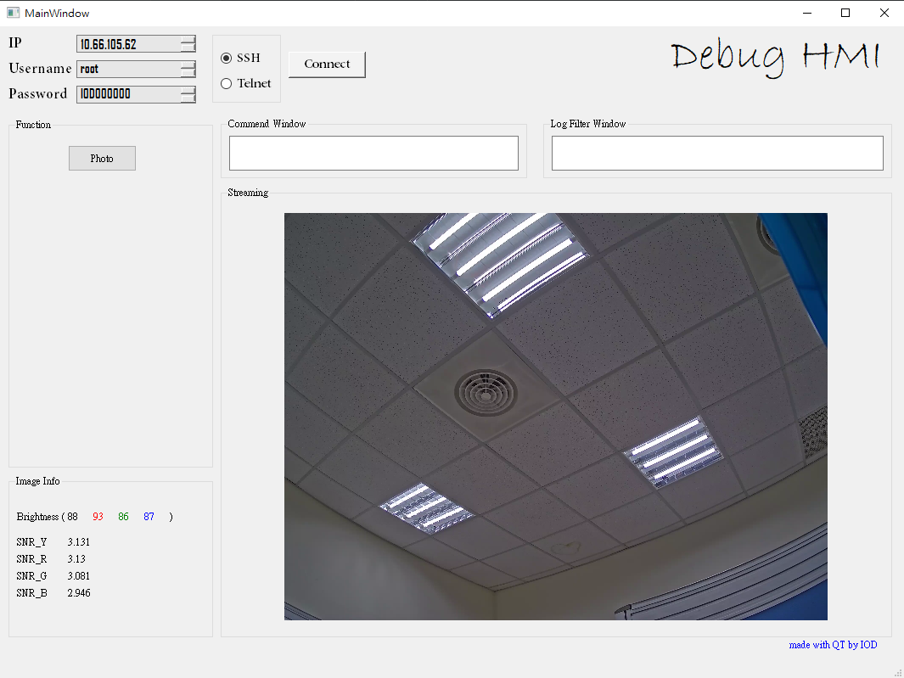
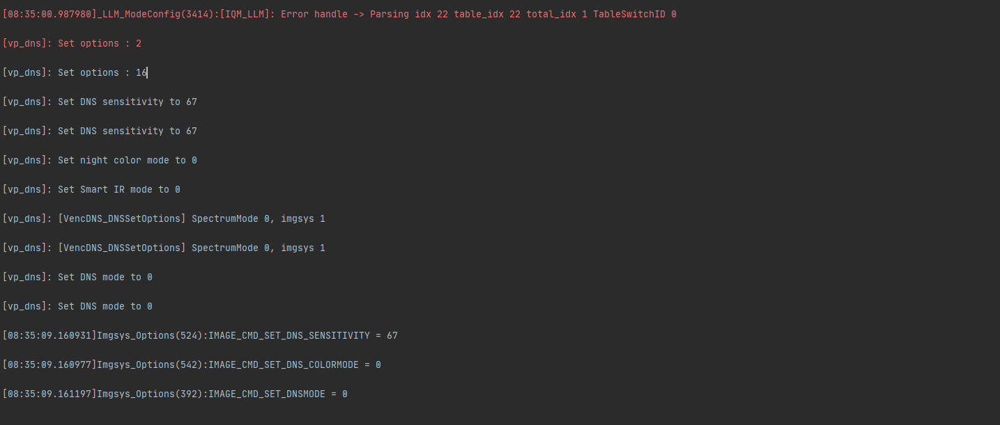
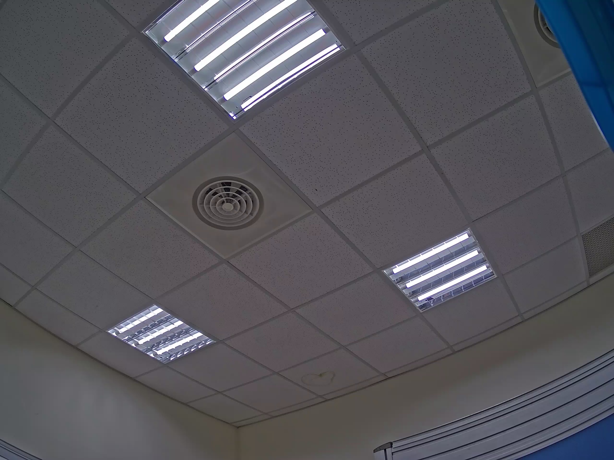

# Image-Debug-Tool
A HMI tool which support streaming , log showing , script and photo grabing

There is this tool's basic function : 

1. Support ssh/telnet connection
2. Streaming and image infomation showing
3. Commend window and Log filter window

4. Customized functions (ex. Take picture button)

